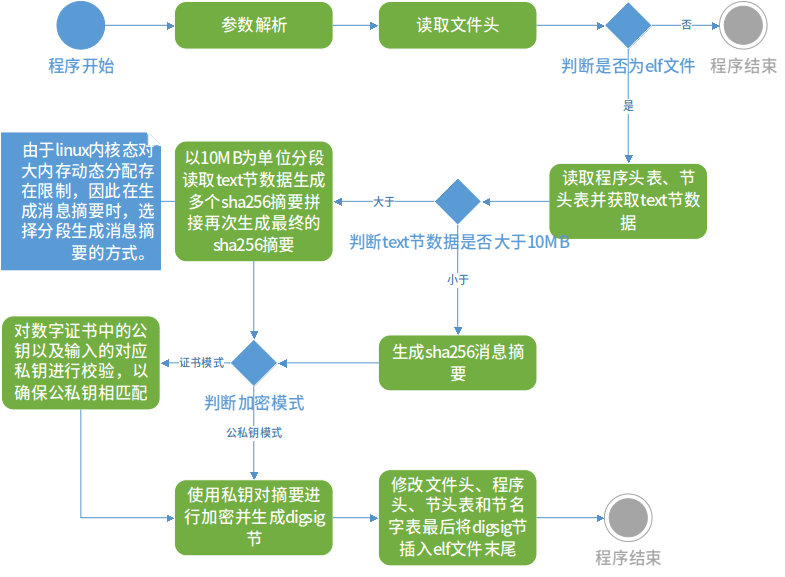
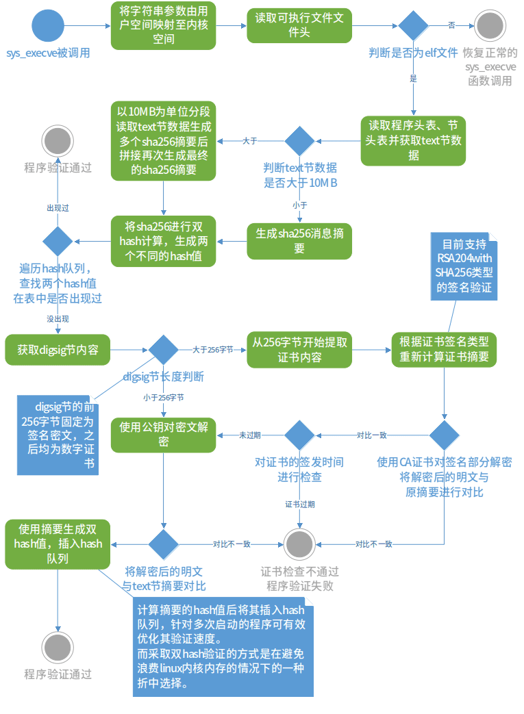

### linux 软件签名保护

- 目录结构：

```
digsign
├── include
│   ├── crt	-> 用户态数字证书解析
│   ├── crypto -> openssl crypto 标准库
│   ├── digsig	-> 签名程序
│   ├── elfrw -> 对elfrw进行解析与修改
│   ├── internal -> openssl internal 标准库
│   ├── openssl -> openssl 标准库
│   └── rsasig -> rsa相关
├── lib -> 静态库
└── src -> 源码路径
    ├── crt  ->
    ├── digsig ->
    ├── elfrw ->
    ├── hook -> 验证程序源码
    │   ├── include
    │   │   ├── kcrt -> 内核态数字证书解析
    │   │   ├── kelf -> 内核态elf文件解析
    │   │   ├── kftrace -> 挂钩系统sys_execve系统调用
    │   │   ├── ksig -> 内核态rsa签名验证
    │   │   └── kstd -> 使用内核态封装了用户层系统api，为上述模块做迁移支持。
    │   └── src 签名程序源码
    │       ├── kcrt
    │       ├── kelf
    │       ├── kftrace
    │       ├── ksig
    │       └── kstd
    └── rsasig
```

- 各模块说明


签名程序各模块说明如下：

- elfrw：提供对elf文件的文件头、节头表、程序头等格式的读取与修改。
- sha256：用于生成256位hash摘要，共32字节。
- crt模块：用于解析crt后缀格式的数字证书，提取其公钥、密文、摘要、签发日期等。
- openssl：提供RSA加密功能。

验证程序各模块说明如下：

- ftrace模块：用于在功能级别上跟踪内核的框架，提供了hook系统调用的功能。
- rdx_crypto：内核级别支持的crypto密码学框架，提供了RSA解密功能。
- 双hash校验模块：用于优化签名验证的流程，每成功完成一次签名验证时，都将计算消息摘要的两个hash值hashMap<bytes,int>，当再次验证该摘要时，可通过遍历hash表在O(N)的时间复杂度内通过验证，其中，N为系统开机以来第一次被启动的可执行文件数量。

- 签名程序编译方法：

```shell
cd ./src/dingsig
make
```
之后可在.digsign/src/dingsig目录下看到digsig程序。

- 验证程序编译方法：

```shell
cd ./src/hook
make
```
之后可在./digsig/src/hook目录下查看到hook.ko驱动。使用下述命令挂载

```shell
sudo insmode hook.ko
```

### 程序使用方法

- 使用rsa密钥进行公私钥加密

使用 -in参数输入可执行文件的路径即可。
```shell
./digsig -in execfilepath
```
execfilepath:可执行文件路径


- 使用数字证书模式进行加密

```
./digsig -in execfilepath -crt crtpath -inkey privkeypath
```

execfilepath：可执行文件路径
crtpath：数字证书路径（不包含证书链，crt后缀）
privkeypath：与证书相匹配的私钥文件路径（pem格式）

### 程序流程图


- 签名程序流程图




- 验证程序流程图

